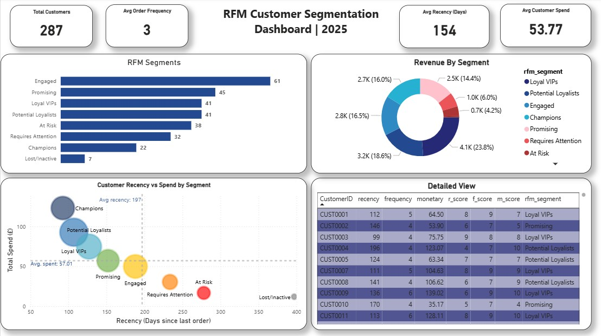

# Project Title: RFM Customer Segmentation Analysis

A full RFM (Recency, Frequency, Monetary) analysis on 12 months of sales data from a print products business. The analysis segments 287 customers into 8 behavioural groups using Google BigQuery, with results visualised in a live Power BI dashboard connected directly to the cloud.

---

## Table of Contents

- [Overview](#overview)
- [Dataset](#dataset)
- [Technologies Used](#technologies-used)
- [Installation](#installation)
- [Usage](#usage)
- [Analysis & Visualizations](#analysis--visualizations)
- [Conclusion](#conclusion)
- [Credits](#credits)
- [License](#license)

---

## Overview

- **Motivation:** RFM segmentation is a proven marketing framework used by businesses to understand customer value. I wanted to apply it end-to-end using cloud tools to replicate a real-world analyst workflow.
- **Objective:** Segment customers based on how recently they purchased, how often they purchased, and how much they spent, then surface those segments in an interactive Power BI dashboard connected live to Google BigQuery.
- **Learning Outcomes:** Gained hands-on experience with Google BigQuery (GoogleSQL), cloud-to-BI connectivity, multi-step SQL pipeline design using CTEs, views and tables, and RFM scoring using `NTILE()` window functions.

---

## Dataset

- **Source:** 12 monthly CSV files (January to December 2025), uploaded directly to Google BigQuery
- **Size:** ~994 rows across 12 tables, 5 columns each
- **Key features/columns used:** `OrderID`, `CustomerID`, `OrderDate`, `ProductType`, `OrderValue`
- **Product types:** Business Card, Canvas Print, Flyer, Greeting Card, Photo Book, Poster
- **Preprocessing:** All 12 monthly tables were appended into a single unified table (`sales_2025`) using `UNION ALL` in BigQuery before analysis began

---

<h2>Technologies Used</h2>

<ul>
  <li><strong>Languages & Query Tools:</strong> GoogleSQL (BigQuery)</li>
  <li><strong>Tools:</strong> Google BigQuery, Power BI, Git, GitHub</li>
  <li><strong>Data Visualization:</strong> Power BI (connected live to BigQuery)</li>
</ul>

<p>
  
  
  
  
</p>

---

## Installation

To replicate this project in your own BigQuery environment:

```bash
# Step 1: Create a BigQuery project and a dataset named "sales"

# Step 2: Upload all 12 CSV files from the /data folder as separate tables
# Name them: 202501, 202502, 202503 ... 202512

# Step 3: Clone this repository
git clone https://github.com/M-Bhurtel/RFM-Customer-Segmentation.git

# Step 4: Open Working.sql in BigQuery
# Replace "rfm-1998" with your own BigQuery project ID

# Step 5: Run each step of the SQL script in order (Steps 1 through 5)

# Step 6: Connect the rfm_segments_final table to Power BI
# Use: Get Data > Google BigQuery connector
```

---

## Usage

1. Open `Working.sql` in the BigQuery query editor
2. Run each of the 5 steps sequentially (each step builds on the previous)
3. After Step 5, the final table `rfm_segments_final` will be available in your dataset
4. Open `RFM_Analysis.pbix` in Power BI Desktop and refresh the data connection
5. The dashboard will populate with your customer segments automatically

---

## Analysis & Visualizations

### RFM Scoring Methodology

Each customer is scored 1 to 10 across three dimensions using `NTILE(10)` window functions:

- **Recency (R):** Days since last order. Fewer days = higher score
- **Frequency (F):** Total number of orders. More orders = higher score
- **Monetary (M):** Total spend. Higher spend = higher score

R, F, and M scores are summed into a combined total score out of 30.

### Customer Segments

| Segment | Score Range | Customer Count |
|---|---|---|
| Champions | 28 - 30 | 22 |
| Loyal VIPs | 24 - 27 | 41 |
| Potential Loyalists | 20 - 23 | 41 |
| Promising | 16 - 19 | 45 |
| Engaged | 12 - 15 | 61 |
| Requires Attention | 8 - 11 | 32 |
| At Risk | 4 - 7 | 38 |
| Lost / Inactive | 0 - 3 | 7 |

### Dashboard



### Key Insights from the Dashboard

- **Loyal VIPs generate the most revenue (23.8%)** despite being only the third largest segment by headcount, proving that headcount alone does not reflect customer value
- **Engaged is the largest segment (61 customers)** but contributes a mid-range share of revenue, indicating moderate spend per customer and an upsell opportunity
- **38 customers are At Risk** with high recency (last purchased over 250 days ago on average) and low spend, making them the most urgent win-back target
- **Champions sit firmly in the top-left quadrant** of the scatter chart with low recency and high spend, confirming the RFM scoring logic is working correctly
- **Average recency across all customers is 154 days** and average spend is £53.77, providing a clear baseline for campaign targeting thresholds

---

## Conclusion

- The RFM pipeline successfully segmented 287 customers into 8 actionable groups using 12 months of transactional data
- Champions and Loyal VIPs represent the highest-value customers and are strong candidates for loyalty rewards and early product access
- At Risk and Requires Attention customers (70 combined) should be targeted with win-back campaigns using time-limited offers
- Promising and Potential Loyalists are ideal for upselling higher-margin products such as Canvas Prints and Photo Books
- The pipeline is fully repeatable. New monthly CSV files can be uploaded to BigQuery and the views will refresh automatically

---

## Credits

- **Project Author:** Mohani Lal Bhurtel - [GitHub Profile](https://github.com/M-Bhurtel)
- **Guided Project:** Based on a LinkedIn guided project by [Mo Chen](https://www.linkedin.com/in/mo-chen1/) - [Website](https://mochen.info/)
- **Dataset Source:** Internal sales CSV files provided as part of the guided project

---

## License

This project is licensed under the [MIT License](https://choosealicense.com/licenses/mit/) - feel free to use and modify it.

---

<p align="center"><strong>Thanks for visiting! 🚀</strong></p>
